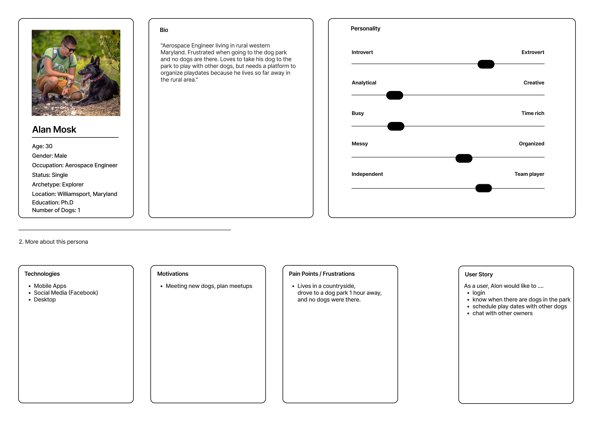
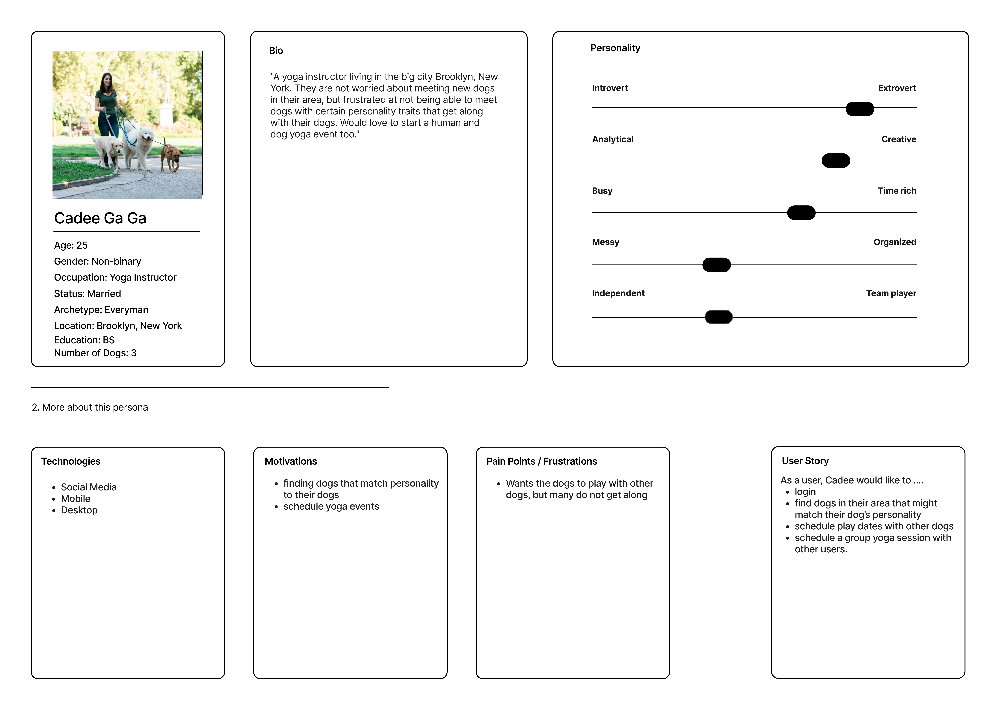
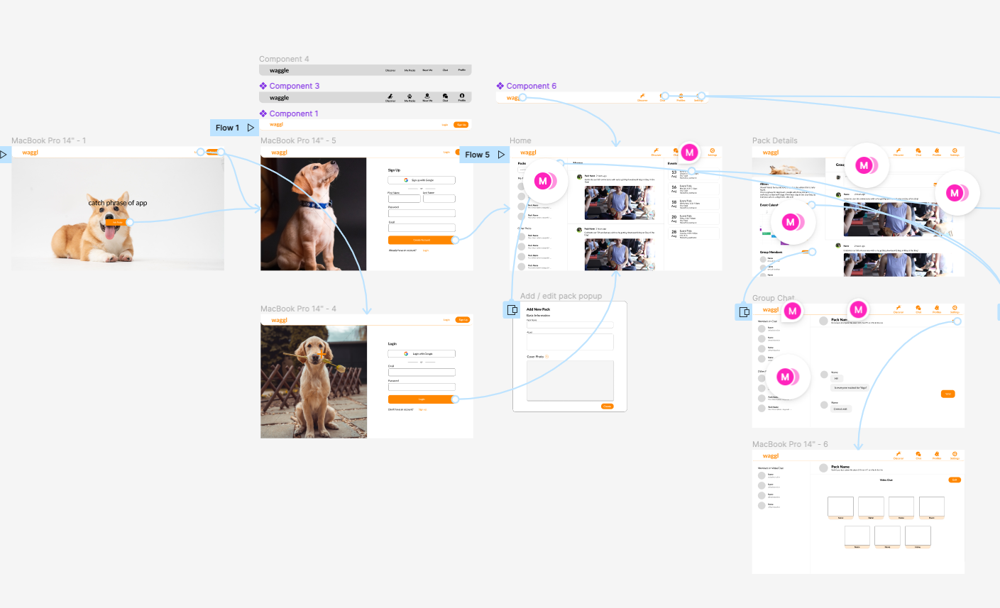
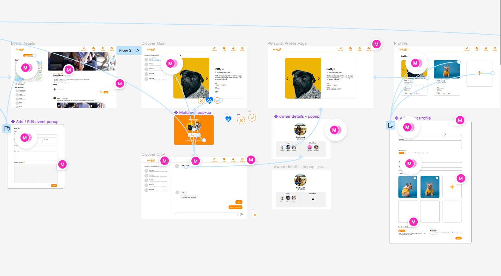
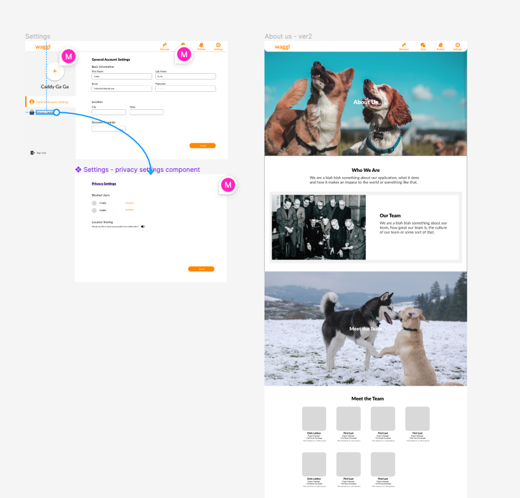
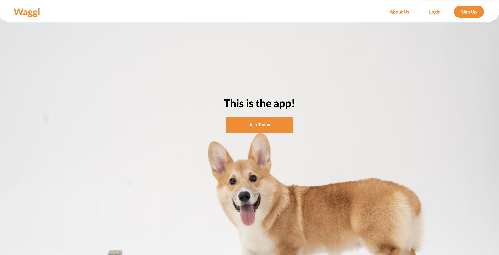
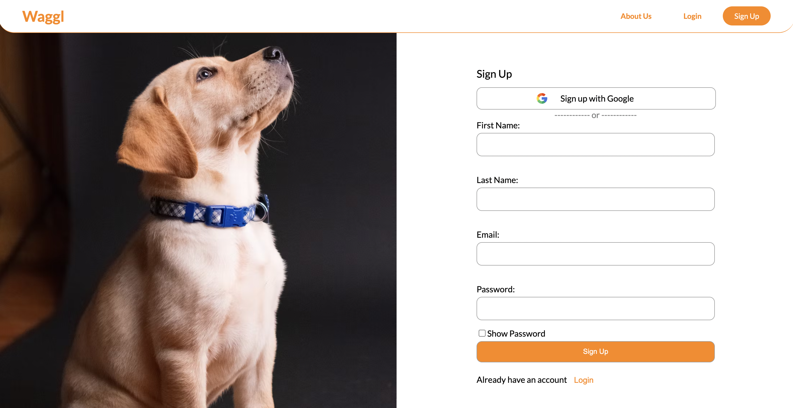
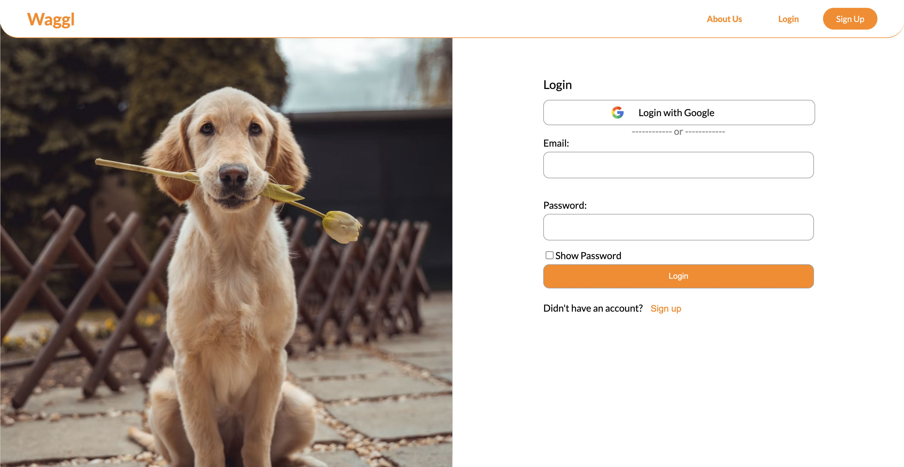
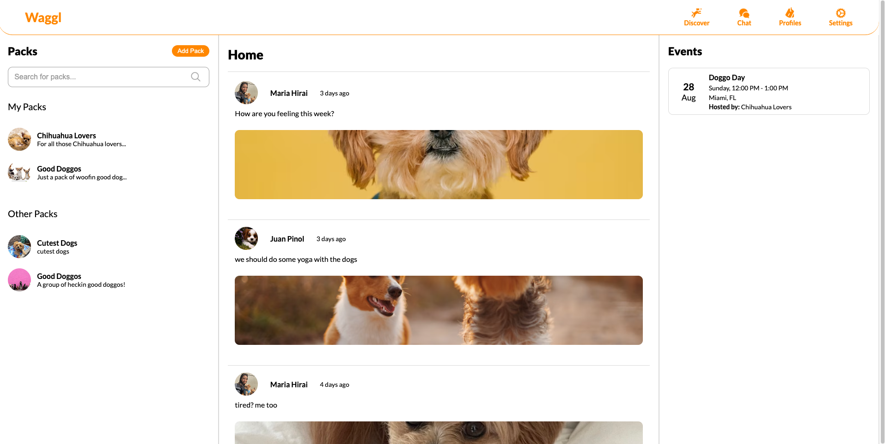
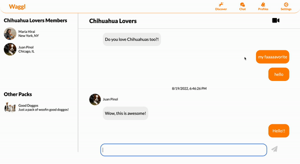

<div id="top"/>

# Waggl
Waggl is a social media platform to help dog owners find like-minded dogs!. This is the culmination of seven engineers working closely over the course of one week to complete an MVP based on client's request.


## Table of Contents
- [Tech Stack](#tech-stack)
- [User Persona & Story](#user-persona--story)
- [Wireframes](#wireframes)
- [Product Features](#product-features)
  - [Home](#home)
  - [Login Authentication with Firebase OAuth](#login-authentication-with-firebase-oauth)
  - [Home Feed](#home-feed)
  - [Pack Details Page](#pack-detail-page)
  - [Event Details Page](#event-detail-page)
  - [Reading Stats](#reading-stats)
  - [Discover](#discover)
  - [Live Chat](#discover-live-chat)
  - [Live Group Chat](#group-live-chat)
  - [Group Video Chat](#group-video-chat)
  - [Dog Profile](#dog-profile)
  - [Profile List](#profile-list)
  - [Settings](#settings)
  - [About Us](#about-us)
- [Getting Started](#getting-started)
  - [Installation](#installation)
- [Contributors](#contributors)


## Tech Stack


## User Persona & Story



## Wireframes





## Product Features

### Home


### Login authentication with Firebase OAuth



### Home Feed
> Users can view packs, posts and upcoming events



### Pack detail page
> Users can view pack details and add an event or post messages


### Event detail page
> Users can view an event detail and post messages


### Discover
> Users can discover other dogs in their neighborhood


### Discover live chat

> Users can live chat with other matched users


### Group live chat

> Users can live chat with users in the same pack


### Group Video Chat
> Users can initiate a video call for pack members to join


### Dog Profile
> Users can open a dog profile to share with others


### Profile List
> Users can view, edit and add dog profiles


### Settings
> Users can edit personal settings


### About us


## Getting Started

### Installation

From the root directory, run the following commands in your terminal.

1. To install all dependencies

```
npm install
```

2. To start dev server: open http://localhost:3000 to view it in your browser

```
npm run dev
```

3. To build for production

```
npm run build-prod
```

4. To connect to the server: use http://localhost:8080 to verify the server connection
```
npm run serve
```


## Contributors

&nbsp;

<a href="https://github.com/Hidden-In-The-Leaves/waggl/graphs/contributors">
  
</a>

&nbsp;

While all members worked as full stack engineers to develop features, we also had these additional roles:

|   |  |
| ------------- | ------------- |
| Product Managers  | [Chris Lathen](https://github.com/haleyjung)  |
| App Architects  | [Juan Pinol](https://github.com/HuijunLu) & [Chenyou Huang](https://github.com/chenyou-H) & [Elizabeth Bivens-Tatum](https://github.com/katyfsy) |
| UI Leads  |[Maria Hirai](https://github.com/maria6417) & [Jordan Addleman](https://github.com/JosephSanfelippo) & [Xinyuan Zheng](https://github.com/katyfsy) |


<p align="right">(<a href="#top">back to top</a>)</p>
